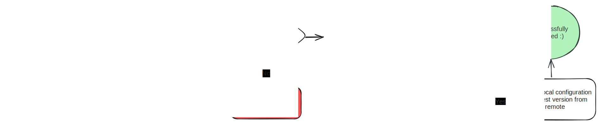

# SAP Cloud Integration Configuration Manager - scicm

Manage SAP Cloud Integration artifact configuration values with Git. Verify artifact configuration changes within SAP Cloud Integration to confidently deploy.

**Disclaimer: This project is not affiliated with SAP in any way. No offical support will be provided.**

## Table of Contents

- [Prerequisites & Installation](#prerequisites--installation)
- [Initial Setup](#initial-setup)
- [Usage](#usage)
  - [Add an Integration Package](#add-an-integration-package)
  - [Verify Configuration Changes](#verify-configuration-changes)
  - [Update Configuration Values](#update-configuration-values)
  - [Add Integration Artifacts](#add-integration-artifacts)

## Prerequisites & Installation

scicm requires the following prerequisites to be installed:

- [Node.js](https://nodejs.org/en/download/) & [npm](https://www.npmjs.com/get-npm)

(not yet available)

## Usage

scicm provides a command line interface (CLI) to manage the configuration values for integration artifacts within SAP Cloud Integration. To get additional information about the available commands and options, run any command with the `--help` flag:

```
% npx scicm init --help

Initialize a new SAP Cloud Integration Configuration Manager (scicm) project.

USAGE
  $ scicm init [--projectName <value>] [--ciUsername <value>] [--ciPassword <value>] [--ciAccountShortName <value>] [--ciSSLHost <value>]
    [--ciRegion <value>]

FLAGS
  --ciAccountShortName=<value>  account short name for the CI instance.
  --ciPassword=<value>          password for the CI OData API.
  --ciRegion=<value>            region for the CI instance.
  --ciSSLHost=<value>           SSL host for the CI instance.
  --ciUsername=<value>          username for the CI OData API.
  --projectName=<value>         name of the scicm project to create.
```

### Initial Setup

To create a new Cloud Integration Configuration Management (scicm) project, run the following command to run the setup wizard and create a new project folder with the necessary configuration:

```bash
npx scicm init
```

After completing the setup wizard for a project named `my-scicm-project`, the following files and folders will be created:

- `./my-scicm-project/` - your scicm project folder
- `./my-scicm-project/scicm-config.json` - scicm configuration file
- `./my-scicm-project/artifact-variables.js` - artifact variables file
- `./my-scicm-project/.env` - environment variables file

Some additional housekeeping files will also be created:

- `./my-scicm-project/package.json` - npm package file
- `./my-scicm-project/package-lock.json` - npm package lock file
- `./my-scicm-project/.gitignore` - git ignore file

### Add an Integration Package

To start monitoring the configuration values for integration artifacts within an integration package, run the following command to run the setup wizard and add a new integration package to your scicm project:

```bash
npx scicm add package
```

After selecting the integration package and the containing integration artifacts to monitor, scicm will export the current version of each artifact's version and configuration values to the `./my-scicm-project/configurations/integration-package-name/` folder.

### Verify Configuration Changes

The current configurations for each managed integration artifact can be verified against the current version of the artifact within SAP Cloud Integration by running the following command:

```bash
npx scicm verify
```

When verifying the configuration values for each integration artifact, scicm will compare the current version and configuration values from SAP Cloud Integration with the latest version and configuration values exported locally.

Optionally, a `--safeUpdate` flag can be used to to update the local version and configuration values to match the current remote version and configuration values from SAP Cloud Integration, as long as the configurations values of the latest local version match the current version and configuration values from SAP Cloud Integration (and are this safe to update).


For every configuration key that is verified, scicm will check the following information:


### Update Configuration Values

When configuration changes are made in SAP Cloud Integration, the configuration values can be updated locally by running the following command:

```bash
npx scicm update
```

When updating the configuration values for an integration artifact, scicm will compare the current version and configuration values from SAP Cloud Integration with the latest version and configuration values exported locally.

If the current configuration values from SAP Cloud Integration match the latest configuration values exported locally, scicm will update the local version and configuration values to match the current version and configuration values from SAP Cloud Integration.

If the remote version of the artifact from SAP Cloud Integration already exists locally, and their the remote and local configurations differ, scicm will not update the local version and configuration values in order to prevent overwriting any local changes. The `--force` flag can be used to force the update of the local configuration values.

### Add Integration Artifacts

Not yet implemented.
