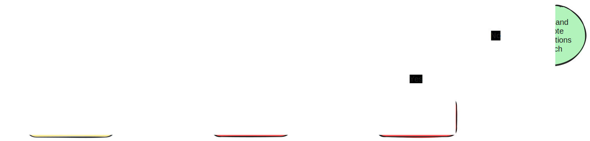

# (SAP) Cloud Integration Configuration Manager - cicm

Manage SAP Cloud Integration artifact configuration values with Git. Verify artifact configuration changes within SAP Cloud Integration to confidently deploy.

## Prerequisites & Installation

cicm requires the following prerequisites to be installed:

- [Node.js](https://nodejs.org/en/download/) & [npm](https://www.npmjs.com/get-npm)

(not yet available)

## Initial Setup

To create a new Cloud Integration Configuration Management (cicm) project, run the following command to run the setup wizard and create a new project folder with the necessary configuration:

```bash
npx cicm init
```

After completing the setup wizard for a project named `my-cicm-project`, the following files and folders will be created:

- `./my-cicm-project/` - cicm project folder
- `./my-cicm-project/cicm-config.json` - cicm configuration file
- `./my-cicm-project/artifact-variables.js` - artifact variables file
- `./my-cicm-project/.env` - environment variables file

Some additional housekeeping files will also be created:

- `./my-cicm-project/package.json` - npm package file
- `./my-cicm-project/package-lock.json` - npm package lock file
- `./my-cicm-project/.gitignore` - git ignore file

## Add an Integration Package

To start monitoring the configuration values for integration artifacts withing an integration package, run the following command to run the setup wizard and add a new integration package to your cicm project:

```bash
npx cicm add package
```

After selecting the integration package and the containing integration artifacts to monitor, cicm will export the current version of each artifact's version and configuration values to the `./my-cicm-project/configurations/integration-package-name/` folder.

## Verify Configuration Changes

The current configurations for each managed integration artifact can be verified against the current version of the artifact within SAP Cloud Integration by running the following command:

```bash
npx cicm verify
```

When verifying the configuration values for each integration artifact, cicm will compare the current version and configuration values from SAP Cloud Integration with the latest version and configuration values exported locally.

Optionally, a `--safeUpdate` flag can be used to to update the local version and configuration values to match the current version and configuration values from SAP Cloud Integration, as long as the configurations values of the latest local version match the current version and configuration values from SAP Cloud Integration (and are this safe to update).


For every configuration key that is verified, cicm will check the following information:


## Update Configuration Values

When configuration changes are made in SAP Cloud Integration, the configuration values can be updated locally by running the following command:

```bash
npx cicm update
```
